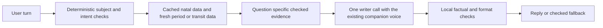

# OpenClaw astrology quality and cost review

6 October 2026. Local changes only; nothing committed, pushed or deployed.

The final release verification follow-up records the latest findings and release blockers.
Earlier sections retain the initial audit measurements; later findings supersede
the initial scope-header failure and the first renderer's English-only/404 behavior.

OpenClaw has a working chart and dasha foundation and a narrow VedAstro matching
adapter. It does **not** implement the full VedAstro reading workflow. The local
patch adds checked evidence for career, education and marriage, removes redundant
astrology instructions and prevents one costly request-replay path. It preserves
the existing friend persona. Full response parity and production readiness remain
unproven because the public chat returned no usable current reference readings,
and the deployed free-form writer produced inconsistent chart facts and unsupported
timing claims. The gateway is reachable with the correct request scope header.

## What is implemented

| Capability | Current local implementation | Remaining limitation |
| --- | --- | --- |
| Natal chart | Date-specific Lahiri, whole-sign placements, all nine planets, consistent primary chart and dasha engine | Global birthplace disambiguation is limited; the resolver primarily supports India |
| Vimshottari | Calculated current major/sub-period boundaries, explicit 365.25-day year convention | A period boundary does not establish an event forecast or VedAstro dasha parity |
| Kundli images | Existing renderer and all-nine-position media contract retained | End-to-end image delivery was not tested in this text-reading comparison |
| VedAstro matching | Main astrologer has an opt-in adapter with eight reviewed factor statuses and a rounded percentage | Matching is not general natal interpretation; the inspected testing environment lacks the enabling variables |
| Topic readings | New local packet with 19 reviewed placement rules and explicit general-symbolism fallback | A deliberately small evidence set, with no verified event timing, divisional strength or aspect interpretation |
| Companion voice | Existing AGENTS and SOUL files unchanged; Meera/Aarav selection and casual chat retained | Preserving files and one writer sample does not prove all live conversational behavior |

The separate `astrofriend-backend` already contains a deterministic preflight,
reading plans, cost metering and some dev-only evidence enrichment. Those features
must not be counted as OpenClaw features. Its source and voice review stages can
also add model calls; inspect the complete cost per turn before adopting it broadly.

VedAstro separates its calculation library and classical event corpus from its
browser chat and MCP summarization. Importing a matching client or a subset of
the corpus does not reproduce that complete application. [VedAstro source](https://github.com/VedAstro/VedAstro)

## Tests and comparison findings

Synthetic profile: 16 February 2002, 08:19, Delhi, 28.6139 latitude, 77.209 longitude,
UTC +05:30. Raw-calculation requests explicitly selected Lahiri.

Five initial OpenClaw testing-gateway requests returned HTTP 403 with
`missing scope: operator.write`. The initial audit client omitted the documented
`x-openclaw-scopes` header. The final live comparison corrects that client and
successfully uses the same testing token; no server permission change was needed.
The initial rejected requests remain access failures, not scored astrology answers.

Four same-profile VedAstro browser questions covered career, education, marriage
timing and chart facts. Career and education reported repeated failed calculations;
marriage and chart facts returned ChatProxy errors. Education's failure reply was
English despite the Hinglish request. None was a usable reference reading. This is
a result for the tested public session, not a claim that the website always fails.

The raw calculation API did produce usable data. All nine signs and whole-sign
houses agreed across successful requests. Four initial calculation envelopes
failed despite HTTP 200; later sequential checks succeeded, and both traces are
retained. The seven physical planets differed by approximately 0.0039–0.0044°.
Rahu/Ketu differed by about 0.9279° with our true-node default. Selecting mean nodes
reduced that difference to approximately 0.00427°, consistent with the reference
using mean nodes. This establishes settings sensitivity for one profile, not
universal numerical equivalence or exact boundary parity.

Controlled DeepSeek writer replays used the local prompt documents and supplied
calculations, with no OpenClaw tool execution or external memory. The earlier
education answer inferred concentration habits and ability without evidence. The
revised answers retained the relevant ruler/house theme and stopped inventing a
marriage date or dasha effects. However, the final education sample still preferred
solitary study over groups, and the marriage sample inferred slow bonding rather
than something sudden. Those implications exceed the admitted themes. HTTP 200
is not a quality pass; prompt instructions alone are not a sufficient release gate.

The friend sample remained warm, contained no chart language and respected the
request for listening without advice.

## Local changes

- `skills/kundli/reading.py` returns at most three relevant factors, checked against
  the current whole-sign chart. It rejects duplicate, missing, nonfinite or
  contradictory positions and inconsistent Moon summaries. It distinguishes
  VedAstro-derived themes from general house symbolism and explicitly withholds
  event forecasts and unsupplied dasha meanings. The upstream MIT notice is retained.
- `calculate.py --reading-topic career|education|marriage` packages those factors
  and fresh period boundaries in one compact result. Ordinary chart and image
  output retain their established fields. New `--node-convention mean` is explicit;
  the true-node default is unchanged. Settings and the reading fingerprint include
  the node choice.
- The calculator no longer installs packages on import, silently substitutes IST,
  creates an ephemeris directory inside a read-only skill mount, or silently
  switches to a secondary chart engine. Missing dependencies, unresolved timezones
  and DST gaps/overlaps fail clearly. Explicit legacy diagnostics remain available;
  topic readings refuse that legacy engine.
- The Docker recipe includes locally tested versions of pyswisseph, timezonefinder
  and timezone data. The image itself still needs a successful build and staging
  smoke test; Docker is unavailable in this workspace.
- Astrology prompts reuse complete confirmed profiles, avoid identical lookups,
  use a topic packet before optional Qdrant retrieval and retain fresh-data and
  subject-ownership checks. The chart guide drops unsupported example dates and
  the false rule that a February birth determines a particular Moon sign.
- The default calculator's repeated language command was replaced with a short
  factual-use note. It no longer contradicts native-script language instructions.
  Qdrant's embedding request has an eight-second timeout.
- The PWA caller now retries exceptions only for connection establishment or pool
  acquisition failures. It does not replay a potentially accepted turn after a
  read/write timeout, response-parsing error or HTTP rejection. Existing bounded
  language-repair behavior remains. [HTTPX exception definitions](https://www.python-httpx.org/exceptions/)

## What the token measurements establish

| Measurement | Before | Final replay | Meaning |
| --- | ---: | ---: | --- |
| Astrology chart guide, tokenizer proxy | 5,150 tokens | 2,158 tokens | About 58% less text when this guide is loaded |
| Career writer input, provider reported | 42,202 tokens | 39,284 tokens | About 6.9% less input in the controlled replay |
| Education writer input, provider reported | 42,213 tokens | 39,294 tokens | About 6.9% less input in the controlled replay |
| Marriage writer input, provider reported | 42,201 tokens | 39,287 tokens | About 6.9% less input in the controlled replay |

The guide counts use `cl100k_base`, not the DeepSeek tokenizer. The complete replay
loads seven known prompt documents; it is not a capture of the deployed gateway's
exact assembled prompt, tool schemas or number of calls. A new topic packet was
about 465–470 proxy tokens in that replay and included its interpretation evidence.
No billed-dollar or deployed savings claim follows from these measurements.

Repeated context remains the main architectural cost. Every tool-planning or
repair call can resend the large prompt plus growing history and tool results.
The checked-in pruning block has no enabled mode, excludes `exec`, and the local
runtime's cache-TTL pruning is restricted to Anthropic routes. It is not a
provider-independent solution for the configured DeepSeek, Gemini and OpenAI
routes. Many non-DeepSeek model cost entries are zero, which also makes local
cost estimates unsuitable for detecting actual spend without a refreshed meter.

## How to reduce cost while improving readings

Make ordinary reading turns use deterministic preparation followed by one writer
call. The writer should receive the unchanged companion voice policy, a compact
current-user context and a checked evidence packet. Resolve ownership, load
necessary memory, calculate and select evidence before that call. Do not ask the
LLM to rediscover each preparation step through separate tool turns.

Use three different caches, with different validity rules. Natal data can be
reused by normalized birth inputs, engine/rule revision, ayanamsa, house and node
settings. Period/transit data needs its own time validity and must refresh at
boundaries. Retry replay should be keyed by authenticated user, channel and
message/request ID, with a payload fingerprint, a durable in-flight/completed
state and a stored result. An ambiguous timeout should consult that state instead
of starting another inference. Never reuse personal response text across users.
The initial patch did not add these caches or replay semantics. The follow-up
below adds natal caching and PWA stream replay, but does not replace the ordinary
OpenClaw reading workflow with a single writer call.

Keep static system policy and stable tool definitions first; put changing birth
details, timestamps, history and the current question later. Reuse the same model
and prefix for a cache group. Caching reduces eligible input charges; it does not
remove the need for sufficient conversation context or eliminate output charges.
OpenAI supports prefix caching, Claude supports explicit cache controls with usage
counters, and Gemini supports caching mechanisms whose API/model requirements
must be checked. Discounts and cache-write costs vary by model. [OpenAI prompt caching](https://developers.openai.com/api/docs/guides/prompt-caching),
[Claude prompt caching](https://platform.claude.com/docs/en/build-with-claude/prompt-caching),
[Gemini context caching](https://ai.google.dev/gemini-api/docs/generate-content/caching)

Measure the whole user turn: writer, tool-planning, reviewer, repair, fallback and
embedding calls; uncached/cached input, output and cache-write tokens; latency;
and the selected provider's current rates. Treat unknown pricing as unknown,
not zero. Add an enforced maximum for calls and input budget, a bounded repair
path and a user-safe fallback. A prompt saying “do not retry” is not enforcement.

## What remains before production

1. Authorize the testing gateway with the required scope and run actual mounted
   prompts, skills, memory, image delivery and client routes end to end. A direct
   writer replay cannot verify tool-loop behavior or deployed files. The Dockerfile
   installs a published OpenClaw package rather than building this checkout's `src/`.
2. Add a constrained writer or checked fallback so meanings are not personalized
   beyond their evidence. Validate factual support, concrete relevance, language,
   warmth, corrections and repeated questions; retain difficult samples as failures.
3. Expand reviewed topic coverage and add computed aspects, strength/divisional
   information and current transits where they are needed. Verified event-timing
   evidence must precede a marriage/job/admission window. Do not copy upstream AI
   summaries or raw deterministic health, death, character or relationship claims.
4. Compare successful reference transcripts with identical birth inputs, ayanamsa,
   node/house conventions and dasha year rules. Include time and sign boundaries,
   partner ownership, missing/uncertain times and native-language review.
5. Implement the bounded single-writer path, durable request deduplication, cache
   invalidation and complete cost telemetry, then benchmark calls/tokens and load.
   The existing lean backend is a useful starting point; preserve the current
   friend policy and review its additional model calls before switching traffic.

## Verification and inspectable evidence

147 focused automated checks passed, with three real-engine legacy-fixture checks
skipped because their cached secondary ephemeris was absent. This includes 33
calculation tests, seven topic-evidence tests, 26 matching tests, five executed
real-engine/renderer tests, 60 prompt/billing contracts and 16 PWA language/retry
tests. The real-engine suite includes 100 generated charts against Swiss
Ephemeris's sidereal API and 100 comparisons with the sibling PWA calculator.
Those are software/calculation checks, not validation of future life predictions.

The workspace `.tmp` directory contains synthetic evidence without access tokens:

- `openclaw-vedastro-review.json`: testing gateway rejections and public browser replies.
- `openclaw-chart-reference.json` and `openclaw-chart-reference-recheck.json`: raw
  planet comparisons, preserving initial failures and successful later checks.
- `openclaw-node-convention-check.json`: true/mean node comparison against the reference.
- `openclaw-local-model-review.json`: initial before/after writer samples, including
  the unsupported interpretations that prompted tighter evidence rules.
- `openclaw-local-model-review-final.json`: final writer samples and token usage;
  remaining overinterpretation is not relabeled as a pass.

The complete Docker build, actual gateway model/tool turns, native-language expert
review and deployed load/cost checks remain outstanding. The patch is reviewable
locally; it is not a production certification.

## Follow-up hardening, 6 October 2026

The additional local changes reduce avoidable inference and strengthen calculation
validation. They do **not** establish full VedAstro reading parity or certify all
edge cases. Friend AGENTS and SOUL files remain byte-identical to the original
checkout. No commits, pushes, deployment changes or customer messages were made.

### Request replay and cost controls

Ordinary PWA chat now uses the existing Redis journal when Redis is configured or
required. The journal claims a message before profile lookup, quotas, media or LLM
work. Its scope includes the authenticated user, selected guide and client channel;
its fingerprint binds text, quotes, attachments, language and other message
semantics. A duplicate replays the original stream, conflicting content gets 409,
and uncertain execution is never silently reclaimed. Different messages retain
latest-turn supersession. The HTTP consumer can disconnect without restarting the
producer. Redis failure rejects work before inference rather than bypassing replay
protection. A local setup without Redis retains its existing unjournaled behavior.

Ordinary response frames expire after 24 hours; content-free request records remain
to prevent blind regeneration. The ordinary journal permits up to 64 MiB of frames
to accommodate existing audio/image replies; the text-burst cap stays 1 MiB. This
requires Redis capacity monitoring, no eviction, persistent storage and a tested
recovery policy. The existing `backend/check_burst_redis.py` checks runtime storage
conditions but does not prove backup recovery. Configure Redis in production;
the local development fallback is not durable deduplication. This journal covers
`/api/chat/stream`, not WhatsApp, voice-call, support or preview endpoints.

Empty and provider-error replies now return the existing localized fallback
without starting another full inference. A potentially accepted request is not
replayed after an ambiguous transport failure. One pre-send connection retry is
still allowed. Language/Tarot repair goes to a new compact `reply_repair` agent:
the payload contains the draft and existing persona/language instructions, without
the original conversation envelope. Tools and skills are disabled and its provider
fallback list is empty. Repair sessions are isolated; the caller makes at most two
gateway requests including any repair. This is a gateway-request bound, not proof
of a universal provider-call/token budget inside the ordinary astrology agent.

The default agent order and existing heartbeat scheduling are preserved. The repair
workspace is included in the image and copied into a mounted state directory on
startup. Deploy the gateway containing this agent before the PWA caller; an older
gateway cannot be assumed to support the new route. No deployment was performed.

Astrologer-only tool-loop detection now warns after four repeated calls, escalates
known polling/alternation loops at six and detects eight identical no-progress
outcomes. The exact pinned runtime source was inspected and its detector exercised
locally with synthetic tool history. Changing output can evade the identical-result
breaker; this is not a hard cap on all inference. Other agents' tool access and
channel bindings are preserved. [OpenClaw tool-loop detection](https://docs.openclaw.ai/tools/loop-detection)

Gateway attempt counts and reported input/output/cache usage are recorded in reply
diagnostics, content-free usage logs and existing conversation metadata. Missing
counters and monetary prices remain unknown rather than zero. These counters do
not claim coverage of unreported internal tool, embedding or reviewer calls.

### Calculation and evidence hardening

- An optional bounded SQLite cache stores only natal calculation results, keyed by
  normalized UTC birth instant, coordinates, node choice, engine version,
  calculator revision and ephemeris file metadata. It has a 4,096-entry limit and
  30-day expiry, validates hits, and recomputes on invalid entries or unavailable
  storage. The image enables it in the private writable state directory. Cache
  reuse does not store personal reply text or user identifiers.
- Current periods are recalculated independently of natal caching. Topic packets
  also refresh their period at the requested timestamp, including exact half-open
  period boundaries, instead of trusting an old chart's current-period summary.
- Topic validation additionally rejects conflicting nakshatras, nonopposing lunar
  nodes, invalid birth coordinates/offsets and unsupported dasha-year settings.
- Whole-sign charts request whole-sign houses from Swiss Ephemeris. They no longer
  depend on Placidus cusp calculation, which fails at high latitudes. Tests cover
  polar-region coordinates and both sides of the date line.
- The CLI accepts paired confirmed latitude/longitude and an explicitly confirmed
  UTC offset for DST ambiguity. Global geocoding uses a five-second timeout and
  rejects multiple results; it no longer appends India to every unknown place.
  Existing local Indian-city lookup remains available.
- Boundary warnings now use numerical proximity. The incorrect claim that a Moon
  within one degree of a sign edge can change signs in two or three minutes and
  the inaccurate hand-written transition-star list were removed.
- The Docker recipe now checks that numerical and timezone dependencies load at
  build time. The complete image has not been built here because Docker is absent.

### Regression evidence and remaining release gates

Final selected regression results: **285 passed, 3 skipped**. The skipped tests
require the absent cached secondary-engine ephemeris; they are not counted as
passes. Syntax checks and both repository whitespace checks passed.

| Suite | Passed | Skipped |
| --- | ---: | ---: |
| Offline calculations | 36 | 0 |
| Natal cache | 6 | 0 |
| Topic evidence | 9 | 0 |
| Real engine, renderer and calculator parity | 7 | 3 |
| VedAstro matching adapter | 26 | 0 |
| Friend, billing, astrology and runtime prompt/config contracts | 63 | 0 |
| PWA existing Python regression suite, including language repair | 90 | 0 |
| PWA replay, usage, burst and storage-preflight tests | 40 | 0 |
| PWA client stream/delivery contracts | 8 | 0 |

Separately, four checks against the downloaded pinned runtime detector verified
the configured breaker, progress-sensitive behavior, distinct calls and disabled
mode. This small harness substitutes logging/plain-object helpers and is not a
complete installed-gateway test.

The new tests exercise concurrent duplicates, payload conflicts, user/guide/channel
isolation, lost ownership, uncertain writes, producer failure, reconnects, media
replay, cache corruption/capacity, corrected calculation inputs, explicit node
settings, invalid coordinates, DST, polar regions and exact period transitions.
Existing language, friend, billing, matching, all-nine-position renderer and client
SSE delivery checks were included.

Broader testing exposed stale horoscope test fixtures: they omitted the current
push-session checks, the conditional token-removal argument, and lookup logging
helpers. The exercised production functions were confirmed identical to HEAD.
The fixtures were updated and a missing/revoked-session rejection test added;
notification eligibility was not weakened.

Run the offline calculator-stub suite and real-engine suite in **separate Python
processes**. The stub suite replaces imported numerical/timezone dependencies and
cannot share one interpreter with the real dependency integration suite. PWA
client tests run from the PWA repository root; backend burst tests run from its
`backend` directory.

Still required before release:

1. A successful image build and staging test of the new agent, mounted assets,
   scopes, memory, languages and image/audio delivery. The earlier testing token
   returned 403; local tests cannot establish gateway authorization or deployment.
2. An enforced evidence-constrained ordinary reading writer and deterministic
   preparation before it. The earlier free-form writer overinterpretations remain
   a known quality blocker. This patch does not claim that prompt instructions or
   loop detection solve them, and it does not swap the ordinary channel workflow.
3. A complete per-turn model-call/token budget and provider spend meter, followed
   by actual load/cost measurements. Reported gateway counters are only one layer.
4. Successful paired reference readings and human language/content review, plus
   broader reviewed evidence before adding aspects, divisional strength, transits
   or event-timing predictions. Unimplemented evidence must not be invented.

The local hardening is reviewable; the system is **not yet approved for production**.

### Deterministic reading follow-up

A deployed-asset plugin now registers the gateway-authenticated
`POST /astrofriend/reading` route. It invokes the verified calculator with
`--reading-topic` and `--render-reading`, then returns reviewed rule text directly.
The route makes **zero model calls**. It admits at most two concurrent calculations,
limits request bodies to 4 KiB, bounds subprocess output to 128 KiB and terminates
calculation after 30 seconds. Invalid requests and calculation failures do not
start a model fallback or repeat the calculation. No birth details are logged.

The first renderer iteration used this route for an exact allowlist of simple English requests about
the user's own career, education or marriage, with complete saved birth details
and no conflicting fields, attachments or quoted message. With recent history,
the user must explicitly request use of their saved birth details. For example,
`Give me a career reading from my saved birth details` is eligible. This prevents
silently ignoring corrections or another person's details from a conversation.
That first iteration fell back on HTTP 404. The final follow-up below removes
this unsafe bypass: an eligible reviewed reading cannot silently switch to an
unverified agent because a plugin is missing.

The renderer accepts the calculated chart, not arbitrary evidence prose. It
rebuilds the verified packet and emits chart facts, reviewed themes, explicit
limitations and a practical follow-up. Source warnings are not copied into the
answer. The result includes its source packet and zero model-call/token counters;
the PWA stores content-free source/counter metadata. Friend conversations, mixed
emotional requests, Tarot, other languages, third-party questions and ordinary
follow-ups retain the existing agent path. **This does not close the broader
free-form evidence-enforcement gap described above.**

PWA ordinary gateway requests now set `max_output_tokens: 2048`, which the pinned
Responses handler forwards as model `maxTokens`. A pre-send connection retry
preserves the identical prompt instead of appending a retry instruction. This is
a **per-model-generation output cap**, not an aggregate turn input/output budget:
the agent can still issue multiple model generations. The deterministic route's
zero-model bound does not apply to those existing agent paths.

The PWA PDF calculator now rejects unresolved timezones and ambiguous/nonexistent
DST birth times. Strict calculation cannot switch to a secondary engine; artifact
generation opts into that strict mode. Whole-sign ascendant calculation now works
at polar latitudes. The container pins the numerical/timezone dependencies and
checks that they load during build. The artifact builder no longer passes the
birth chart as a purported Navamsa image; the current PDF renderer only consumes
the birth-chart entry, so this removes misleading data without deleting a
rendered PDF page.

The cumulative local regression result is **302 passed, 3 skipped**: 156 OpenClaw
checks and 146 PWA checks. The three skips require legacy ephemeris data. New
tests cover deterministic rendering, injected chart prose, request validation,
concurrency release, failure sanitization, route eligibility, actual PWA inference
bypass, friend routing, strict PDF calculation, DST and polar cases. A real
synthetic-birth CLI smoke test returned the reviewed response with zero model
calls. The plugin loading/authentication checks are source contracts, not an
installed-gateway integration test. Docker is unavailable locally and the earlier
staging authentication failure remains unresolved. No deployment or push occurred.

Release still requires an installed-image staging test, successful gateway
authorization, broad multilingual/free-form evidence enforcement, a transport-level
aggregate model budget, actual load/cost measurements and successful paired
VedAstro response review. These remaining requirements are not marked complete.

### Fresh live comparison and fixes

The repeat check on 6 October used three identical synthetic-profile questions
against VedAstro's public website and the existing **dev OpenClaw deployment**:
career in English, education in Hinglish, and marriage timing in English. The
profile was 16 February 2002 at 08:19 in Delhi, UTC +05:30, requesting Lahiri.
An additional VedAstro career test used 14:15, a profile that had produced a
successful reading in an earlier audit. All four current website tests failed:
two calculation failures and two ChatProxy errors. Therefore there is no valid
current paired response-quality score. An old successful response is not a
substitute for a current same-input comparison.

The dev gateway accepted all three requests after the audit client supplied
`x-openclaw-scopes: operator.write`, as required by the pinned runtime's HTTP
endpoint helper. The earlier 403 was an audit-client omission, not a deficient
testing token. No permissions, configuration or deployment were changed.

| Question | Deployed dev response finding | Local verified result |
| --- | --- | --- |
| Career | Aquarius ascendant, but inferred abilities/preferences and a post-2028 career take-off without verified timing evidence | Aquarius; Mars rules house 10 and occupies house 2; reviewed family-enterprise/trade theme only |
| Education | Jupiter placed in house 4; inferred focus and patience from period/nakshatra names | Jupiter is in Gemini, house 5. The admitted education factor is Mercury, ruler of house 5, in house 12 |
| Marriage timing | Pisces ascendant and Mercury as marriage-house ruler, contradicting the same-input career reply; forecast a 2027–2028 window | Aquarius ascendant; Sun rules house 7 and occupies house 1. No supported marriage window is supplied |

Gateway-reported total token counts were 30,721, 29,754 and 64,656 respectively.
These are raw gateway counters, not audited dollars or a complete per-model-call
cost attribution. They demonstrate why a per-generation output limit must not be
described as an aggregate turn budget. These deployed answers do not include the
local changes: nothing has been pushed or deployed.

The local changes now route these three question forms to verified readings when
the authenticated caller has complete saved birth details and the existing
ownership/history checks admit them. English and Hinglish are supported through
fixed reviewed text, without a translation or review model call. Marriage timing
is a distinct intent: it directly explains the missing timing evidence, rather
than pretending an overview answers the date question. Answers lead with the
relevant theme, show up to two verified factors, and keep limitations concise.
Unknown extra clauses, corrections, other-person queries, emotional requests,
quotes and attachments are not silently discarded to force this route. Friend
and Tarot paths remain unchanged.

The response contract now checks language and intent as well as topic. Missing
routes, bad outputs and service failures return a localized non-predictive response;
they do not fall back to free-form model inference. **Install and verify the
gateway plugin before releasing the PWA caller.** Supported requests intentionally
fail closed if that dependency is unavailable.

A startup bug was also closed: a persistent state mount can hide assets copied
into `.openclaw` during a Docker build. Immutable bootstrap copies now refresh the
release-managed calculator modules and astrology guides before gateway startup.
Tests verify repeat startup and preservation of friend AGENTS/SOUL, memories,
credentials and chart caches. An incomplete asset bundle prevents startup instead
of serving mixed calculator versions.

The actual HTTP handler was exercised locally with the real Python calculator for
all three cases: all returned HTTP 200, identical chart fingerprints and zero model
calls. The replies were 52, 61 and 68 words respectively. Brevity is measured here;
it is not a substitute for factual or language quality. This is a local HTTP/calculator integration check, **not** an installed
OpenClaw gateway authentication or Docker-image test. Raw synthetic traces are in
the workspace temporary artifacts `vedastro-reference-oct6.json`,
`vedastro-reference-alternate-oct6.json`, `openclaw-gateway-oct6.json` and
`local-reviewed-smoke-oct6.json`. No credentials are included in these reports.

The latest cumulative regression result is **311 passed, 3 skipped** (162 OpenClaw
and 149 PWA checks). The skips still require legacy ephemeris data. The full PWA
Python suite passed 92 tests; the focused backend suites passed 49. New regressions
cover the live same-profile contradiction, exact benchmark routing, Hinglish rule
coverage, marriage-timing intent, malformed or mismatched results, fail-closed
behavior and mounted-state bootstrap preservation. Friend AGENTS/SOUL files remain
unchanged. No image build, deployment or publication is represented by these tests.

Production approval remains withheld. The supported verified paths are improved,
but arbitrary free-form readings, other languages/channels, aggregate agent-loop
budgets, and installed-image delivery checks remain outside the completed fixes.
A successful reference reading and human language/content review are still needed
to establish the intended quality benchmark. Passing local tests does not make
the remaining agent paths evidence-enforced.

### Installed runtime and response contract follow-up

The published `openclaw@2026.3.28` runtime now loads the reviewed-reading plugin
successfully in an isolated local gateway. Real HTTP checks rejected missing and
incorrect credentials (401), invalid input (400), unsupported methods (405) and
oversized bodies (413). Authenticated career, Hinglish education and marriage
timing requests all returned 200 through the real Python calculator, with the
same verified Aquarius chart fingerprint and zero model calls/tokens. The PWA
validator accepted all three actual responses. This closes the previously missing
installed-runtime authentication and calculator-delivery check; it does not
replace a Linux Docker build or deployment verification.

Both the gateway and PWA now reject whitespace-only answers, missing evidence
schema/revision/fingerprint, missing or unsupported factor sources, and evidence
that claims unsupported period interpretation. The Python caller also rejects
boolean/float values masquerading as integer zero-usage counters. This pass's
focused regression suites passed 72 Node checks, 8 Python client checks, 21
language/recovery checks and the installed-gateway integration test: 102 passes.
The PWA no longer repeats its language policy inside stored user messages; it
retains the policy in the model instructions and the selected-language metadata.
This reduces duplicated context without removing language or friend-persona rules.
The opt-in `tests/test_reviewed_reading_gateway.mjs` reproduces the installed
gateway checks with synthetic data, a temporary state directory and no model API.
Set `OPENCLAW_TEST_ENTRY` to the published package's `dist/entry.js` and put the
Python executable with pinned numerical dependencies on `PATH` as `python3`.

The aggregate-budget investigation found a concrete runtime coverage gap. Native
model SDK retries happen below ordinary agent hooks. A scoped transport prototype
passed six retry/concurrency/payload-budget checks, but Pi's compaction functions
call `completeSimple` directly, outside the ordinary agent stream wrapper. A
wrapper-only limit would therefore not cover all paid calls. The prototype remains
in temporary investigation files and is not enabled or shipped. A complete fix
must cover inference, fallback, SDK retries and compaction together, including
provider auth-profile selection and cancellation. Per-generation output caps and
tool-loop detection remain useful, but are not an aggregate token/cost ceiling.

No friend persona files, remote credentials, deployed configuration or deployments
were changed. Free-form multilingual astrology and an enforceable aggregate model
budget remain release blockers; VedAstro quality parity is still unestablished
because the fresh reference requests failed at VedAstro's tool/model layer.

### Release verification follow-up

This section supersedes the preceding aggregate-budget prototype limitation.
The shipped local inference-budget plugin now wraps the pinned Pi SDK public
provider registry and scopes the actual HTTP transport. It covers ordinary text
inference, SDK retries, provider fallbacks and native compaction without changing
provider identities, credentials or the compaction algorithm. Workspace extensions
bind compaction before it runs. Startup validates the installed runtime, SDK,
workspace shims and supported configured transports; unsupported transports fail
startup instead of silently bypassing the limit.

Each guarded run reserves at most six HTTP attempts, 192 KiB per request, 512 KiB
aggregate request bodies, 2,048 output tokens per call and 12,288 reserved output
tokens overall, with an 80-second inference deadline. Reservations include failed
attempts because their billing outcome may be unknown. Input limits measure
serialized bytes, not exact model tokens. Separate repair runs have separate
budgets. External tool processes and non-text APIs are outside this guard; this
is not an account-wide currency limit. Budget exhaustion gives ordinary chat a
bounded language-aware fallback and leaves failed compaction history intact.

The actual published gateway passed SDK retry/fallback checks and concurrent tool
loops, with each run independently stopping at six upstream requests. Native
Google payload capping and Pi compaction failure/history preservation passed
against the installed SDK. These tests use local synthetic providers and incur
no paid model calls. The two installed-runtime suites passed; 81 focused Node
checks also passed. Calculation, cache, topic, renderer and matching suites passed
36, 6, 9, 5 and 26 tests respectively; real-engine checks passed nine with three
legacy-data skips.

PWA Redis claim, append, snapshot and stream cleanup now have deadlines. Tests
exercise stalled storage and cleanup without regenerating an uncertain response.
Provider exceptions, rejected bodies and language-repair drafts no longer enter
the changed chat logs. The full PWA Python suite passed 93 tests before the final
logging regression was added; the subsequently rerun language suite passed 22.
Backend handler, ASGI, replay, delivery, usage and reading suites passed 107 test
executions (some shared fixtures are discovered twice). Frontend delivery checks
passed eight. These counts are not a claim of distinct cumulative coverage.

The intended frontend release snapshot passed TypeScript and Vite production
builds. A full dirty-workspace build remains blocked by an unrelated, untracked
onboarding component with missing exports and incompatible fields. That file and
its companion place-search file were preserved and excluded from the release
snapshot. Existing large-bundle warnings remain. Both repositories pass
`git diff --check`; friend AGENTS/SOUL files are unchanged. The upstream monorepo
test/lint/build suite has not been run; deployment uses the separately published
gateway package tested above.

The supplied test account successfully completed the public production OTP login
and reached the chat composer without browser errors. This verifies the deployed
baseline only. No local code was deployed, no chat was sent from that account,
and no account profile, payment or subscription was changed. Read-only deployment
inspection confirmed production PWA uses branch `master` and OpenClaw uses `main`;
the development PWA uses a different backend pipeline.

Release approval remains withheld pending a Linux Docker build and container
startup/delivery checks, staging verification of both services together, and
production Redis durability/capacity preflight. This machine has no Docker,
Podman or installed WSL distribution; a builder location was requested. Broader
free-form and multilingual astrology remains outside the deterministic reviewed
route, and fresh successful VedAstro reference answers plus human content review
are still needed before claiming response parity. Run relevant image, voice and
existing companion flows in staging before promotion. Deploy and verify the
gateway endpoint before the PWA client that requires it, retaining rollback images
and compatible state backups. Nothing has been committed, pushed or deployed.

### Additional edge cases and broader regression verification

The next local review closed additional startup bypasses: global plugin disable,
allow/deny exclusions, missing load paths, inherited default fallbacks and
per-model transport overrides are now checked. Both installed Pi package versions
are validated. The configured production model selection passes these checks.

The reviewed-reading HTTP client now limits decoded response bodies to 128 KiB
and applies a 35-second overall deadline in addition to HTTP read timeouts.
Oversized and continuously trickling bodies stop without another generation;
caller cancellation still propagates and closes the response. All ten client and
routing tests pass. The Redis preflight script is now included in the backend
image, where its documented invocation previously could not find it.

Anonymous previews no longer replay a full generation after provider-error text.
Preview language correction uses the isolated draft-only repair agent, and its
requests explicitly cap output at 2,048 tokens. The existing corrective attempt
for a complete birth profile incorrectly answered with a birth-details form is
preserved and tested. This remains a separate bounded generation, not a claim of
one aggregate allowance for the entire PWA transaction. Preview error logging no
longer includes provider response bodies. Astrology workflow examples containing
fixed marriage dates and unsupported planetary combinations were removed; the
friend AGENTS/SOUL files remain untouched.

Broader offline regression testing initially exposed outdated tests expecting
replays after HTTP errors, empty replies and read timeouts. Those expectations
were changed to explicitly forbid an ambiguous paid replay, while preserving
identical-payload retries for connection failures known to occur before sending.
Assertions for persona, language, private quota instructions, saved profiles,
media context and successful delivery were retained. A missing local Firebase
test dependency was installed separately in the temporary test environment.
The resulting backend run passes **287 test executions, zero failures/errors or
skips**, covering chat/ASGI delivery, Redis recovery, login cooldowns, payment
session identity, account ownership, quota rules, saved profiles, notifications
and safety routing. Shared fixture inheritance means this is not a count of
287 distinct scenarios. Frontend delivery and OTP suites pass eight and seven
tests respectively. The installed gateway retry/concurrency suite, native Google
and compaction suite, and authenticated real-chart delivery suite all pass again.
The focused Node startup/bootstrap/route/budget run passes 22 tests.
The final PWA root regression suite passes 94 tests. A newly assembled release
snapshot containing all 19 intended PWA additions/modified files passes TypeScript
and the Vite production build; the unrelated unfinished onboarding files remain
excluded. The existing large LiveKit bundle warning remains.

The broader upstream source-suite gate is still unavailable. `pnpm test` cannot
find Vitest; a frozen dependency install exposes a pre-existing disagreement:
the four Pi packages are declared as 0.70.5 in the committed manifest but locked
at 0.51.1. Attempting lockfile reconciliation also exposes the committed root
package name `AstroHans` while workspace plugins require `openclaw@workspace:*`.
No dependency versions, package names or lockfile were changed. These source-tree
issues are separate from the published 2026.3.28 runtime exercised by the release
tests, but the full monorepo checks cannot be represented as passing.

All three fresh VedAstro website requests again failed: career reported repeated
calculation-tool failure, while education and marriage returned ChatProxy errors.
The synthetic trace is `vedastro-reference-oct6-followup.json` in the workspace
temporary directory. These are availability failures, not quality scores, and
they cannot establish answer parity. No post-deployment comparison has occurred.

Read-only GitHub checks confirmed both production branches still match the local
base commits. Deployment inspection found one existing reachable Coolify server,
but no separately identified builder or available local Docker runtime. A Linux
builder/connection was requested and remains needed for container and staging
verification. The push condition has therefore not been met. No commit, push,
deployment or remote configuration change was performed in this follow-up.

### Authorized dev staging candidate

The user subsequently authorized updating and pushing only the `dev` branches and
deploying the existing Coolify development applications. Production promotion is
explicitly withheld. Isolated local clones merge the current production branch
into each dev branch before applying the reviewed fixes. The PWA onboarding work
is excluded. The dev PWA provider will be switched from the alternate backend to
the dev OpenClaw gateway for staging tests; its alternate-provider support is
retained and separately tested. Earlier statements about no pushes describe the
previous audit stages, not authorization for a production deployment.
